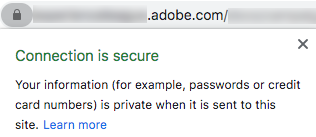

# Processus de demande de certificat SSL

Une fois que vous avez délégué un domaine à l’Adobe pour l’envoi d’un courrier électronique (voir [Configuration des noms de domaine](/help/additional-resources/ac-domain-name-setup.md)), Adobe crée et utilise certains sous-domaines pour des fonctions spécifiques.

Par exemple, si vous avez délégué *email.example.com* pour Adobe de l’envoi d’emails, Adobe crée des sous-domaines tels que :
* *t.email.example.com* - pour les liens de suivi
* *m.email.example.com* - pour les pages miroir
* *res.email.example.com* - pour les ressources hébergées (telles que les images)

Il est recommandé de **sécuriser ces domaines via SSL (HTTPS) ;**. En effet, les liens non sécurisés (HTTP) sont vulnérables à l’interception et afficheront des avertissements sur les navigateurs modernes.

Pour installer des certificats SSL sur ces sous-domaines, le processus implique la demande d’un fichier CSR et l’achat ultérieur de certificats SSL pour que l’Adobe les installe ou les renouvelle.

>[!CAUTION]
>
>Avant d’installer un certificat SSL, assurez-vous de connaître les conditions préalables répertoriées dans la section [cette page](https://experienceleague.adobe.com/docs/control-panel/using/subdomains-and-certificates/renewing-subdomain-certificate.html?lang=fr#installing-ssl-certificate).
>
>Adobe ne prend en charge que les certificats 2 048 bits maximum. Les certificats 4 096 bits ne sont pas encore pris en charge.

## Glossaire

| Terme | Description |
|--- |--- |
| CA (Certificate Authority) | Fournisseur de certificats SSL qui émet des certificats numériques aux organisations ou aux individus après vérification de leur identité, comme DigiCert, Symantec, etc.<ul><li>Une autorité de certification approuvée est généralement considérée comme une autorité de certification tierce qui émet un certificat racine.</li><li>Si le certificat est signé par la même organisation/société qui utilise le certificat, il est classé comme autorité de certification non approuvée même s’il s’agit de certificats SSL, tels que des certificats auto-signés.</li></ul> |
| Certificat de chaîne | Un certificat qui comprend un certificat racine et un ou plusieurs certificats intermédiaires est appelé certificat de chaîne (ou chaîné). |
| CSR (demande de signature de certificat) | Bloc de texte codé remis à une autorité de certification lors de la demande d’un certificat SSL. Il est généralement généré sur le serveur sur lequel le certificat est installé. |
| DER (Distinguished Encoding Rules) | Un type d’extension de certificat. L’extension .der est utilisée pour les certificats codés DER binaires. Ces fichiers peuvent également prendre en charge l’extension .cer ou .crt. |
| Certificat EV (validation étendue) | Un certificat EV est un nouveau type de certificat conçu pour empêcher les attaques de phishing. Cela nécessite une validation étendue de votre entreprise et de la personne qui commande le certificat. |
| Certificat de haute assurance | Les certificats à haute assurance sont émis par l’autorité de certification après vérification de la propriété du nom de domaine et d’un enregistrement commercial valide. |
| Autorité de certification intermédiaire | Une autorité de certification de certificats intermédiaires inclus dans un certificat de chaîne. |
| Certificat intermédiaire | Une autorité de certification émet des certificats sous la forme d’une arborescence. Le certificat racine est le certificat le plus élevé de l’arborescence. Tout certificat entre votre certificat et le certificat racine est appelé certificat de chaîne ou intermédiaire. |
| Certificat de faible assurance | Un certificat à faible assurance, également appelé certificat validé par domaine, inclut uniquement le nom de domaine dans le certificat (et non le nom de l’entreprise/de l’organisation). |
| PEM (Privacy Enhanced Mail) | Un certificat avec une extension .pem contenant des données ASCII (Base64). Ces certificats commencent par une ligne &quot; - - - - - BEGIN CERTIFICATE - - -&quot;. |
| Certificat racine | Une autorité de certification émet des certificats sous la forme d’une arborescence. Le certificat racine est le certificat le plus élevé de l’arborescence. |
| SAN (subject Alternative Name) | Les noms alternatifs du sujet sont des noms d’hôte supplémentaires (sites, adresses IP, noms communs, etc.) qui doit être signé dans le cadre d’un seul certificat SSL. |
| Certificat auto-signé | Un certificat signé par la personne qui le crée plutôt qu’une autorité de certification approuvée. Les certificats auto-signés peuvent activer le même niveau de chiffrement qu’un certificat signé par une autorité de certification, mais il existe deux inconvénients principaux :<ul><li>La connexion d’un visiteur peut être détournée, ce qui permet à un attaquant d’afficher toutes les données envoyées (ce qui va à l’encontre de l’objectif de cryptage de la connexion).</li><li> Le certificat ne peut pas être révoqué comme un certificat approuvé le peut.</li></ul> |
| SSL (Secure Sockets Layer) | Technologie de sécurité standard permettant d’établir un lien chiffré entre un serveur web et un navigateur. |
| Certificat générique | Un certificat générique peut sécuriser un nombre illimité de sous-domaines de premier niveau sur un seul nom de domaine, comme *.adobe.com. |

## Principales étapes

1. Demandez un fichier de demande de signature de certificat (CSR) et fournissez les informations requises (pays, état, ville, nom de l’organisation, nom de l’entité organisationnelle, etc.) à l’Adobe.
1. Validez le fichier CSR généré par Adobe et vérifiez que toutes les informations que vous avez fournies sont correctes.
1. Utiliser les détails de la demande de signature de certificat pour générer un certificat signé par une autorité de certification approuvée<!--taking care of asking for using the subjectAltName SSL extension (SAN) if it is for several domain names, and get/purchase the resulting certificate (ideally) in PEM format for Apache server-->.
1. Validez le certificat SSL et vérifiez qu’il correspond à la demande de signature de certificat (CSR).
1. Fournissez le certificat SSL à Adobe, qui l’installera.
1. Vérifiez que le certificat SSL est bien installé pour chaque sous-domaine sécurisé.
1. Surveillez la période de validité du certificat SSL.
1. Mettez à jour toute configuration spécifique dans Adobe Campaign.

## Processus détaillé

### Conditions préalables

Vous devez identifier les noms de domaine et les fonctions (tracking, pages miroir, applications web, etc.) pour sécuriser.
>[!NOTE]
>
>Adobe peut vous aider à définir les noms de domaine et les fonctions à impliquer. Pour plus d’informations, contactez votre équipe de compte d’Adobe.

### Étape 1 - Obtention d’un fichier CSR

Pour obtenir un fichier CSR (Certificate Signing Request), procédez comme suit.

* Si vous avez accès au [Panneau de Contrôle](https://experienceleague.adobe.com/docs/control-panel/using/control-panel-home.html?lang=fr), suivez les instructions de la section [cette page](https://experienceleague.adobe.com/docs/control-panel/using/subdomains-and-certificates/renewing-subdomain-certificate.html#subdomains-and-certificates) pour générer et télécharger un fichier CSR à partir du Panneau de Contrôle.

* Sinon, créez un ticket d’assistance via https://adminconsole.adobe.com/ pour obtenir un fichier CSR auprès de l’Assistance clientèle d’Adobe pour le ou les sous-domaines requis.

Voici quelques bonnes pratiques à suivre :

* Envoyez une requête par sous-domaine délégué.
* Il est possible de combiner plusieurs sous-domaines en une seule requête CSR, mais uniquement au sein du même environnement. Par exemple, en Campaign Classic, le serveur marketing, la variable [serveur de mid-sourcing](https://experienceleague.adobe.com/docs/campaign-classic/using/installing-campaign-classic/install-campaign-on-prem/mid-sourcing-server.html), et la variable [instance d&#39;exécution](https://experienceleague.adobe.com/docs/campaign-classic/using/transactional-messaging/configure-transactional-messaging/configuring-instances.html#execution-instance) sont trois environnements distincts.
* Vous devez obtenir une nouvelle demande de signature de certificat avant tout renouvellement de certificat SSL. N’utilisez pas un ancien fichier CSR d’il y a un an ou plus.

Vous devrez fournir les informations suivantes.

>[!CAUTION]
>
>Tous les champs indiqués dans les tableaux ci-dessous doivent être renseignés. Dans le cas contraire, la demande de demande de signature de certificat ne peut pas être traitée.

**Informations à fournir avec l’aide de l’équipe Adobe :**

| Informations à fournir | Exemple de valeur | Remarque |
|--- |--- |--- |
| Nom du client | Ma société Inc. | Nom de votre organisation. Ce champ est utilisé par Adobe pour le suivi de votre demande (il ne fera pas partie du certificat CSR/SSL). |
| URL de l’environnement Adobe Campaign | https://client-mid-prod1.campaign.adobe.com | URL de l’instance Adobe Campaign. |
| Nom commun [CN] | t.subdomain.customer.com | Il peut s’agir de l’un des domaines pertinents, mais généralement du domaine de suivi. |
| Nom alternatif du sujet [SAN] | t.subdomain.customer.com | Veillez à inclure le sous-domaine de suivi en tant que SAN. |
| Nom alternatif du sujet [SAN] | m.subdomain.customer.com |
| Nom alternatif du sujet [SAN] | res.subdomain.customer.com |

**Informations à fournir par votre équipe interne IT/SSL :**

| Informations à fournir | Exemple de valeur | Remarque |
|--- |--- |--- |
| Pays [C] | US | Il doit s’agir d’un code à deux lettres. Accéder à la liste complète des pays [here](https://www.ssl.com/csrs/country_codes/). *Remarque : Pour le Royaume-Uni, utilisez GB (et non UK).* |
| État (ou nom de la province) [ST] | Illinois | Le cas échéant. La valeur doit être un nom complet et non abrégé. |
| Nom de la ville/de la localité [L] | Chicago |
| Nom de l’organisation [O] | ACME |
| Nom de l’entité organisationnelle [OU] | IT |

>[!NOTE]
>
>Remplacez &quot;subdomain.customer.com&quot; par le sous-domaine délégué, et les autres exemples de valeurs par les valeurs appropriées.

### Étape 2 - Validation du fichier CSR

Après avoir envoyé votre demande avec les informations appropriées, Adobe génère et vous fournit un fichier de demande de signature de certificat (CSR).

Le texte du fichier CSR obtenu doit commencer par **&quot;—COMMENCER LA DEMANDE DE CERTIFICAT—&quot;**.

Une fois que vous avez reçu le fichier CSR d’Adobe, procédez comme suit :

1. Copiez et collez le texte du fichier CSR dans un décodeur en ligne tel que https://www.sslshopper.com/csr-decoder.html, <!--https://www.certlogik.com/decoder/,--> ou https://www.entrust.net/ssl-technical/csr-viewer.cfm.
Vous pouvez également utiliser la variable *OpenSSL* sur une machine Linux.
1. Vérifiez que toutes les vérifications sont réussies.
1. Vérifiez que les paramètres et noms de domaine corrects sont inclus.
1. Vérifiez que toutes les autres données correspondent aux détails que vous avez fournis lors de l’envoi de votre demande.

### Étape 3 - Génération du certificat SSL

Une fois le fichier CSR fourni, vous devez acheter et générer un certificat SSL pour les domaines appropriés à l’aide du fichier CSR.

* Le certificat SSL :
   * doit être au format Apache PEM ;
   * ne doit pas dépasser 2 048 bits ;
   * doit être signé par une autorité de certification valide ;
   * doit inclure tous les SAN (subject Alternative Names) comme indiqué dans le fichier CSR.
* S’il existe un ou plusieurs certificats intermédiaires, vous devez fournir le certificat racine et tous les certificats intermédiaires à Adobe.
* Vous pouvez définir n’importe quelle période de validité du certificat, mais Adobe recommande de la choisir suffisamment longtemps (deux ans, par exemple).

>[!NOTE]
>
>Si vous utilisez vos propres outils internes ou un portail fourni par une autorité de certification pour demander le certificat, veillez à utiliser les mêmes détails que ceux fournis dans la demande de demande de signature de certificat afin d’éviter tout retard ou incohérence dans le processus de génération du certificat.

### Étape 4 - Validation du certificat SSL

Une fois le certificat SSL généré, vous devez le valider avant de l’envoyer à Adobe. Procédez comme suit :

1. Assurez-vous que le certificat possède l’extension .pem. Si ce n’est pas le cas, convertissez-le au format PEM. Vous pouvez effectuer la conversion à l’aide de *OpenSSL*.
1. Confirmez que le certificat commence par **&quot;—COMMENCER LE CERTIFICAT—&quot;**.
1. Copiez le texte du certificat dans un décodeur en ligne, tel que https://www.sslshopper.com/certificate-decoder.html ou https://www.entrust.net/ssl-technical/csr-viewer.cfm.
Vous pouvez également utiliser la variable *OpenSSL* sur une machine Linux. Voir à ce sujet la section [cette page externe](https://www.shellhacks.com/decode-ssl-certificate/).
1. Assurez-vous que le certificat est résolu correctement, y compris le nom commun, le SAN, l’émetteur et la période de validité.
1. Si la vérification du certificat SSL est réussie, vérifiez que le certificat correspond à la demande de signature de certificat en utilisant [ce site web](https://www.sslshopper.com/certificate-key-matcher.html): select **Vérification de la correspondance d’une CSR et d’un certificat** et saisissez votre certificat et votre demande de signature de certificat dans les champs correspondants. Ils devraient correspondre.

### Étape 5 - Demander l’installation du certificat SSL

* Si vous avez accès au [Panneau de Contrôle](https://experienceleague.adobe.com/docs/control-panel/using/control-panel-home.html?lang=fr), suivez les instructions de la section [cette page](https://experienceleague.adobe.com/docs/control-panel/using/subdomains-and-certificates/renewing-subdomain-certificate.html?lang=fr#installing-ssl-certificate) pour télécharger le certificat vers Panneau de Contrôle.

* Sinon, créez un autre ticket d’assistance via https://adminconsole.adobe.com/ pour demander à l’Adobe d’installer le certificat sur le ou les serveurs d’Adobe.

Vous devrez fournir les éléments suivants :

* Le fichier de certificat, le certificat racine et les certificats intermédiaires (joints au ticket), de préférence au format Apache PEM.
* Numéro du ticket d’assistance précédent collecté pour la demande de signature de certificat.
* Les mêmes données que celles fournies pour le ticket de CSR (notamment le nom commun, l’URL de l’instance, l’état, la ville/localité, le nom de l’organisation, le nom de l’unité de l’organisation, etc.).

### Étape 6 - Test de l’installation du certificat SSL

Une fois le certificat SSL installé et confirmé par l’Assistance clientèle d’Adobe, vérifiez qu’il a bien été installé pour toutes les URL.

Effectuez les tests ci-dessous avant de fermer le ticket d’installation SSL. Veillez également à mettre à jour toute configuration spécifique en suivant les instructions de la section [cette section](#update-configuration).

Accédez aux URL suivantes dans votre navigateur (remplacez &quot;subdomain.customer.com&quot; par votre sous-domaine) :

* https://subdomain.customer.com/r/test (pour [applications web](https://experienceleague.adobe.com/docs/campaign-classic/using/designing-content/web-applications/about-web-applications.html) sous-domaines uniquement - ne s’applique pas aux sous-domaines de messagerie)
* https://t.subdomain.customer.com/r/test
* https://m.subdomain.customer.com/r/test
* https://res.subdomain.customer.com/r/test

Un résultat réussi donne des informations sur l’environnement, et la barre d’adresse de l’URL indique que la connexion est sécurisée. Par exemple, le message suivant s’affiche dans Google Chrome :

Si le certificat SSL n’est pas installé correctement, l’avertissement suivant s’affiche :

### Etape 7 - Vérification de la période de validité du certificat

Vous pouvez vérifier la période de validité du certificat dans votre navigateur. Par exemple, dans Google Chrome, cliquez sur **Sécurisé** > **Certificat**.

Il vous appartient de vérifier la période de validité. Adobe vous recommande de mettre en oeuvre un processus pour surveiller l’expiration du certificat. En savoir plus sur ce qui se passe lorsque votre certificat SSL expire dans [cet article](https://www.thesslstore.com/blog/what-happens-when-your-ssl-certificate-expires/).

* Créez un ticket d’assistance pour demander un certificat mis à jour au moins deux semaines avant la date d’expiration du certificat. Vous n’avez pas besoin de demander une demande de signature de certificat supplémentaire, sauf si les détails de la demande de signature de certificat ont changé.

* Si vous avez accès au [Panneau de Contrôle](https://experienceleague.adobe.com/docs/control-panel/using/control-panel-home.html?lang=fr)et si votre environnement est hébergé par Adobe dans un environnement AWS, vous pouvez utiliser le Panneau de Contrôle pour renouveler le certificat avant son expiration. En savoir plus dans [cette section](https://experienceleague.adobe.com/docs/control-panel/using/subdomains-and-certificates/monitoring-ssl-certificates.html#monitoring-certificates).

### Etape 8 - Mettre à jour toute configuration spécifique {#update-configuration}

Une fois que vous êtes certain que les certificats SSL demandés sont correctement installés, vous pouvez mettre à jour toutes les références dans Adobe Campaign de HTTP vers HTTPS.

>[!NOTE]
>
>Pour Campaign Classic, les URL à mettre à jour se trouvent principalement dans la variable [Assistant de déploiement](https://experienceleague.adobe.com/docs/campaign-classic/using/installing-campaign-classic/initial-configuration/deploying-an-instance.html#deployment-wizard) et dans le [Comptes externes](https://experienceleague.adobe.com/docs/campaign-classic/using/installing-campaign-classic/accessing-external-database/external-accounts.html?lang=fr) (suivi, page miroir et domaines de ressources publiques). Pour le Campaign Standard, reportez-vous à la section [Paramétrage de l&#39;identité graphique](https://experienceleague.adobe.com/docs/campaign-standard/using/administrating/application-settings/branding.html#about-brand-identity).

Une fois les configurations mises à jour, de nouveaux emails sont envoyés avec des URL HTTPS plutôt qu’avec le protocole HTTP. Pour vérifier que les URL sont désormais sécurisées, vous pouvez rapidement effectuer les tests suivants :

* Téléchargez une image à partir d’Adobe Campaign. Une fois l’image téléchargée, l’URL renvoyée doit être en HTTPS.
* Créez une diffusion email de test comprenant un lien de page miroir, certaines images, du texte et un lien de désinscription. Envoyez le courrier électronique à un ID de courrier électronique externe (comme votre adresse Gmail). Une fois reçu, ouvrez l’email et assurez-vous que tous les liens qu’il contient s’ouvrent correctement dans leur formulaire HTTPS (et non HTTP), sans avertissement de certificat SSL ni erreur.

## Ressources spécifiques au produit

**Campaign Classic**

* [Panneau de Contrôle : Ajout de certificats SSL (tutoriel)](https://experienceleague.adobe.com/docs/campaign-classic-learn/control-panel/subdomains-and-certificates/adding-ssl-certificates.html) - Découvrez comment ajouter des certificats SSL pour sécuriser vos sous-domaines.

**Campaign Standard**

* [Panneau de Contrôle : Ajout de certificats SSL (tutoriel)](https://experienceleague.adobe.com/docs/campaign-standard-learn/control-panel/subdomains-and-certificates/adding-ssl-certificates.html?lang=fr) - Découvrez comment ajouter des certificats SSL pour sécuriser vos sous-domaines.
