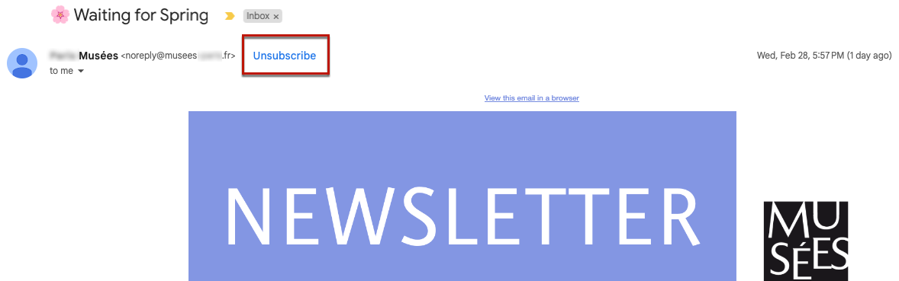

# Campaign Classic : recommandations techniques {#technical-recommendations}

Vous trouverez ci-dessous plusieurs techniques, configurations et outils que vous pouvez utiliser pour améliorer votre taux de délivrabilité lors de l’utilisation de Adobe Campaign Classic.

## Configuration {#configuration}

### Reverse DNS {#reverse-dns}

Adobe Campaign vérifie qu’un reverse DNS est bien renseigné pour une adresse IP et que celui-ci reboucle bien sur l’IP.

Un point indispensable de la configuration réseau est d&#39;avoir établi un reverse DNS correct pour chacune des adresses IP d&#39;envoi. Cela signifie que pour une adresse IP donnée, il existe un enregistrement reverse DNS (enregistrement PTR) dont la correspondance DNS (enregistrement A) reboucle sur l&#39;adresse IP initiale.

Le choix du domaine pour un reverse DNS a une incidence lorsque vous traitez avec certains FAI. AOL, en particulier, n’accepte que les feedback loops dont l’adresse appartient au même domaine que le reverse DNS (voir la section [Feedback loop](#feedback-loop)).

>[!NOTE]
>
>Vous pouvez utiliser [cet outil externe](https://mxtoolbox.com/SuperTool.aspx) pour vérifier la configuration d’un domaine.

### Règles MX {#mx-rules}

Les règles MX (Mail eXchanger) correspondent aux règles de gestion de communication entre un serveur expéditeur et un serveur destinataire.

Plus précisément, elles servent à contrôler la vitesse à laquelle le MTA (Message Transfer Agent) Adobe Campaign envoie les emails à chaque domaine d’email ou FAI (par exemple, hotmail.com, comcast.net). Ces règles sont généralement basées sur les limites publiées par les FAI (par exemple, ne pas inclure plus de 20 messages par connexion SMTP).

>[!NOTE]
>
>Pour plus d&#39;informations sur la gestion des MX dans Adobe Campaign Classic, consultez [cette section](https://experienceleague.adobe.com/docs/campaign-classic/using/installing-campaign-classic/additional-configurations/email-deliverability.html?lang=fr#mx-configuration).

### TLS {#tls}


(Transport Layer Security) est un protocole de cryptage qui peut être utilisé pour sécuriser la connexion entre deux serveurs de messagerie et empêcher la lecture du contenu d’un email par une autre personne que le destinataire prévu.

### Domaine de l’expéditeur {#sender-domain}

Pour définir le domaine utilisé pour la commande HELO, éditez le fichier de configuration de l&#39;instance (conf/config-instance.xml) et définissez un attribut &quot;localDomain&quot; comme suit :

```
<serverConf>
  <shared>
    <dnsConfig localDomain="mydomain.net"/>
  </shared>
</serverConf>
```

Le domaine MAIL FROM est le domaine utilisé dans les messages techniques rebonds. Cette adresse est définie dans l&#39;assistant de déploiement ou via l&#39;option NmsEmail_DefaultErrorAddr .

### Enregistrement SPF {#dns-configuration}

Un enregistrement SPF peut actuellement être défini sur un serveur DNS comme un enregistrement de type TXT (code 16) ou un enregistrement de type SPF (code 99). Un enregistrement SPF prend la forme d’une chaîne de caractères. Par exemple :

```
v=spf1 ip4:12.34.56.78/32 ip4:12.34.56.79/32 ~all
```

définit les deux adresses IP, 12.34.56.78 et 12.34.56.79, comme autorisées à envoyer des emails pour le domaine. **~all** signifie que toute autre adresse doit être interprétée comme un SoftFail.

Recommendations pour définir un enregistrement SPF :

* Ajoutez **~all** (SoftFail) ou **-all** (Échec) à la fin pour rejeter tous les serveurs autres que ceux définis. Sans cela, les serveurs seront en mesure de forger ce domaine (avec une évaluation Neutre).
* N’ajoutez pas **ptr** (openspf.org recommande de ne pas le définir comme coûteux et peu fiable).

>[!NOTE]
>
>En savoir plus sur SPF dans [cette section](/help/additional-resources/authentication.md#spf).

## Authentification

>[!NOTE]
>
>Pour en savoir plus sur les différentes formes d&#39;authentification des emails, consultez [cette section](/help/additional-resources/authentication.md).

### DKIM {#dkim-acc}

>[!NOTE]
>
>Pour les installations hébergées ou hybrides, si vous avez effectué une mise à niveau vers le [MTA amélioré](https://experienceleague.adobe.com/docs/campaign-classic/using/sending-messages/sending-emails/sending-an-email/sending-with-enhanced-mta.html?lang=fr#sending-messages), la signature de l’authentification des emails DKIM est effectuée par celui-ci pour tous les messages et domaines.

L’utilisation de [DKIM](/help/additional-resources/authentication.md#dkim) avec Adobe Campaign Classic requiert les conditions préalables suivantes :

**Déclaration d’option Adobe Campaign** : dans Adobe Campaign, la clé privée DKIM est basée sur un sélecteur DKIM et un domaine. Il n’est actuellement pas possible de créer plusieurs clés privées pour le même domaine/sous-domaine avec des sélecteurs différents. Il n&#39;est pas possible de définir quel domaine/sous-domaine de sélecteur doit être utilisé pour l&#39;authentification, ni dans la plateforme, ni dans l&#39;email. La plateforme sélectionnera également l’une des clés privées, ce qui signifie que l’authentification a de grandes chances d’échouer.

* Si vous avez configuré DomainKeys pour votre instance Adobe Campaign, vous devez simplement sélectionner **dkim** dans les [règles de gestion des domaines](https://experienceleague.adobe.com/docs/campaign-classic/using/sending-messages/monitoring-deliveries/understanding-delivery-failures.html?lang=fr#email-management-rules). Dans le cas contraire, suivez les mêmes étapes de configuration (clé privée/clé publique) que pour DomainKeys (qui a remplacé DKIM).
* Il est inutile d&#39;activer DomainKeys et DKIM pour un même domaine, DKIM étant une version améliorée de DomainKeys.
* Les domaines validant actuellement DKIM sont les suivants : AOL, Gmail.

## Feedback loop {#feedback-loop-acc}

Une boucle de rétroaction fonctionne en déclarant au niveau du FAI une adresse e-mail donnée pour une plage d’adresses IP utilisées pour l’envoi de messages. Le FAI enverra à cette boîte de réception, de la même manière que pour les messages de rebond, ces messages qui sont signalés par les destinataires comme spam. La plateforme doit être configurée pour bloquer les futures diffusions aux utilisateurs qui se sont plaints. Il est important de ne plus les contacter même s’ils n’ont pas utilisé le lien d’opt-out approprié. C’est sur la base de ces plaintes qu’un FAI ajoutera une adresse IP à sa liste bloquée. Selon le FAI, un taux de plainte d’environ 1 % entraînera lle blocage d’une adresse IP.

Un standard est en cours d’établissement pour définir le format des messages de feedback loop : l’[ARF (Abuse Feedback Reporting Format)](https://tools.ietf.org/html/rfc6650).

La mise en place d&#39;une feedback loop pour une instance suppose d&#39;avoir :

* une boîte mail dédiée à l&#39;instance, qui peut éventuellement être la boîte de mails rebonds,
* des adresses IP d&#39;envoi dédiées à l&#39;instance.

La mise en œuvre d’une feedback loop simple dans Adobe Campaign fait appel à la fonctionnalité de messages rebonds. La boîte email de feedback loop est utilisée comme boîte de rebond et une règle est définie pour détecter ces messages. Les adresses email des destinataires qui ont signalé le message comme indésirable seront ajoutées à la liste des adresses en quarantaine.

* Créez ou adaptez une règle de mails rebonds **Feedback_loop** dans **[!UICONTROL Administration>Gestion de campagne>Gestion des NP@I>Jeux de règles mail]** avec la raison **Refusé** et le type **Hard**.
* Si une boîte a été définie spécialement pour la feedback loop, définissez les paramètres pour relever son contenu en créant un nouveau compte externe de type Mails rebonds dans **[!UICONTROL Administration>Plateforme>Comptes externes]**.

Le mécanisme est immédiatement opérationnel pour traiter les notifications de plaintes. Pour vérifier le bon fonctionnement de la règle, vous pouvez temporairement désactiver les comptes afin qu&#39;ils ne relèvent pas ces messages, puis vérifier le contenu de la boîte de feedback loop manuellement. Sur le serveur, exécutez les commandes suivantes :

```
nlserver stop inMail@instance,
nlserver inMail -instance:instance -verbose.
```

Si vous êtes contraint d&#39;utiliser une seule adresse de feedback loop pour plusieurs instances, il faudra :

* répliquer les messages reçus sur autant de boîtes qu&#39;il existe d&#39;instances,
* faire relever chaque boîte par une seule instance,
* Configurez les instances pour qu’elles ne traitent que les messages qui les concernent : les informations d’instance se trouvent dans l’en-tête Message-ID des messages envoyés par Adobe Campaign et figurent donc également dans les messages de feedback loop. Il vous suffit de spécifier le paramètre **checkInstanceName** dans le fichier de configuration de l’instance (par défaut, l’instance n’est pas vérifiée, ce qui peut entraîner une mise en quarantaine abusive de certaines adresses) :

  ```
  <serverConf>
    <inMail checkInstanceName="true"/>
  </serverConf>
  ```

Le service Délivrabilité d&#39;Adobe Campaign gère votre inscription aux services de feedback loop pour les FAI suivants : AOL, BlueTie, Comcast, Cox, EarthLink, FastMail, Gmail, Hotmail, HostedEmail, Libero, Mail.ru, MailTrust, OpenSRS, QQ, RoadRunner, Synacor, Telenor, Terra, UnitedOnline, USA, XS4ALL, Yahoo, Yandex, Zoho.

## List-Unsubscribe {#list-unsubscribe}

L&#39;ajout d&#39;un en-tête SMTP appelé **List-Unsubscribe** est obligatoire pour une gestion optimale de la délivrabilité.

Cet en-tête peut être utilisé comme alternative à l’icône &quot;Signaler comme SPAM&quot;. Il s’affiche sous la forme d’un lien &quot;Se désabonner&quot; dans les interfaces de messagerie des FAI.

L’utilisation de cette fonctionnalité réduit les taux de plaintes et contribue à protéger votre réputation. Les commentaires seront exécutés comme un désabonnement.

Gmail, Outlook.com, Yahoo! et Microsoft Outlook prennent en charge cette méthode. Un lien &quot;Se désabonner&quot; est disponible directement dans leur interface. Par exemple :


>[!NOTE]
>
>Le lien &quot;Se désabonner&quot; peut ne pas toujours être affiché. En effet, elle peut dépendre de critères et de politiques spécifiques de chaque FAI. Par conséquent, assurez-vous que vos messages sont envoyés par un expéditeur :
>
>* Bonne réputation
>* Sous le seuil de plainte pour spam des FAI
>* Entièrement authentifié

Il existe deux versions de la fonctionnalité d’en-tête List-Unsubscribe :

* **&quot;mailto&quot; List-Unsubscribe** - Avec cette méthode, cliquer sur le lien **Se désabonner** envoie un courrier électronique prérempli à l’adresse de désabonnement spécifiée dans l’en-tête de courrier électronique. [En savoir plus](#mailto-list-unsubscribe)

* **&quot;One-Click&quot; List-Unsubscribe** - Avec cette méthode, cliquer sur le lien **Unsubscribe** désabonne directement l’utilisateur. [En savoir plus](#one-click-list-unsubscribe)

>[!NOTE]
>
>À compter du 1er juin 2024, les principaux fournisseurs de services Internet exigeront que les expéditeurs se conforment à la **List-Unsubscribe en un clic**.

### &quot;mailto&quot; List-Unsubscribe {#mailto-list-unsubscribe}

Avec cette méthode, cliquez sur le lien **Se désabonner** pour envoyer un email prérempli à l’adresse de désabonnement spécifiée dans l’en-tête de l’email.

Pour utiliser &quot;mailto&quot; List-Unsubscribe, vous devez saisir une ligne de commande où vous spécifiez une adresse email, par exemple : `List-Unsubscribe: <mailto:client@newsletter.example.com?subject=unsubscribe?body=unsubscribe>`

>[!CAUTION]
>
>L&#39;exemple ci-dessus est basé sur la table des destinataires. Si l&#39;implémentation de la base de données est faite à partir d&#39;une autre table, pensez à reformuler la ligne de commande avec l&#39;information correcte.

Vous pouvez également créer un List-Unsubscribe &quot;mailto&quot; dynamique en utilisant une ligne de commande telle que : `List-Unsubscribe: <mailto:<%=errorAddress%>?subject=unsubscribe%=message.mimeMessageId%>`

Pour implémenter **&quot;mailto&quot; List-Unsubscribe** dans Campaign, vous pouvez :

* Ajoutez directement la ligne de commande dans la diffusion ou le modèle de diffusion - [Découvrez comment](#adding-a-command-line-in-a-delivery-template)

* Créer une règle de typologie - [Découvrez comment &#x200B;](#creating-a-typology-rule)

#### Ajouter une ligne de commande dans une diffusion ou un modèle {#adding-a-command-line-in-a-delivery-template}

La ligne de commande doit être ajoutée dans la section **[!UICONTROL En-têtes SMTP supplémentaires]** de l&#39;en-tête SMTP de l&#39;email.

Cet ajout peut se faire dans chaque email, ou dans les modèles de diffusion existants. Vous pouvez aussi créer un nouveau modèle de diffusion qui inclue cette fonctionnalité.

Par exemple, saisissez le script suivant dans le champ **[!UICONTROL En-têtes SMTP supplémentaires]** : `List-Unsubscribe: mailto:unsubscribe@domain.com`. Cliquer sur le lien **unsubscribe** envoie un courrier électronique à l’adresse unsubscribe@domain.com.

Vous pouvez également utiliser une adresse dynamique. Par exemple, pour envoyer un email à l&#39;adresse d&#39;erreur définie pour la plateforme, vous pouvez utiliser le script suivant : `List-Unsubscribe: <mailto:<%=errorAddress%>?subject=unsubscribe%=message.mimeMessageId%>`


#### Créer une règle de typologie {#creating-a-typology-rule}

La règle de typologie doit contenir le script qui génère la ligne de commande et être inclue dans l&#39;en-tête de l&#39;email.

Découvrez comment créer des règles de typologie dans Adobe Campaign v7/v8 dans [cette section](https://experienceleague.adobe.com/docs/campaign-classic/using/orchestrating-campaigns/campaign-optimization/about-campaign-typologies.html?lang=fr#typology-rules).

>[!NOTE]
>
>Nous vous recommandons de créer une règle de typologie : la fonctionnalité List-Unsubscribe sera automatiquement ajoutée à chaque email à l&#39;aide de cette règle de typologie.

### Liste-Unsubscribe en un clic {#one-click-list-unsubscribe}

Avec cette méthode, cliquer sur le lien **Se désabonner** désabonne directement l’utilisateur, ne demandant qu’une seule action pour se désabonner.

À compter du 1er juin 2024, les principaux fournisseurs de services Internet exigeront que les expéditeurs se conforment à la **List-Unsubscribe en un clic**.

Pour se conformer à cette exigence, les expéditeurs doivent :

* Ajoutez la ligne de commande suivante : `List-Unsubscribe-Post: List-Unsubscribe=One-Click`.
* Incluez un lien de désabonnement d’URI.
* Prise en charge de la réception de la réponse du POST HTTP par le récepteur, prise en charge par Adobe Campaign. Vous pouvez également utiliser un service externe.

Pour prendre en charge la réponse du POST Unsubscribe-List en un clic directement dans Adobe Campaign v7/v8, vous devez ajouter dans l&#39;application web &quot;No-click&quot; (Désabonner les destinataires sans clic). Pour ce faire, procédez comme suit :

1. Accédez à **[!UICONTROL Resources]** > **[!UICONTROL Online]** > **[!UICONTROL Applications Web]**.

1. Téléchargez le fichier [XML](/help/assets/WebAppUnsubNoClick.xml.zip) de &quot;Désabonner les destinataires sans clic&quot;.

Pour configurer **Unsubscribe-List-One-Click** dans Campaign, vous pouvez effectuer l’une des opérations suivantes :

* Ajoutez la ligne de commande dans la diffusion ou le modèle de diffusion - [Découvrez comment](#one-click-delivery-template)
* Créer une règle de typologie - [Découvrez comment &#x200B;](#one-click-typology-rule)

#### Configuration de la liste en un clic - Désabonner dans la diffusion ou le modèle {#one-click-delivery-template}

Pour paramétrer le Unsubscribe de type Liste en un clic dans la diffusion ou le modèle de diffusion, procédez comme suit.

1. Accédez à la section **[!UICONTROL SMTP]** des propriétés de la diffusion.

1. Sous **[!UICONTROL En-têtes SMTP supplémentaires]**, saisissez les lignes de commande comme dans l’exemple ci-dessous. Chaque en-tête doit se trouver sur une ligne distincte.

Par exemple :

```
List-Unsubscribe-Post: List-Unsubscribe=One-Click
List-Unsubscribe: <https://domain.com/webApp/unsubNoClick?id=<%= recipient.cryptedId %> >, < mailto:<%@ include option='NmsEmail_DefaultErrorAddr' %>?subject=unsubscribe<%=escape(message.mimeMessageId) %> >
```


L’exemple ci-dessus permettra l’option Unsubscribe de liste en un clic pour les FAI qui prennent en charge l’option Un clic, tout en s’assurant que les destinataires qui ne prennent pas en charge &quot;mailto&quot; peuvent toujours demander le désabonnement par courrier électronique.

#### Création d&#39;une règle de typologie pour la prise en charge du Unsubscribe comme liste en un clic {#one-click-typology-rule}

Pour configurer le désabonnement à la liste en un clic à l’aide d’une règle de typologie, procédez comme suit.

1. Dans l’arborescence de navigation, accédez à **[!UICONTROL Règles de typologie]** et cliquez sur **[!UICONTROL Nouveau]**.

   


1. Configurez la nouvelle règle de typologie, par exemple :

   * **[!UICONTROL Type de règle]** : **[!UICONTROL Contrôle]**
   * **[!UICONTROL Phase]** : **[!UICONTROL Au début du ciblage]**
   * **[!UICONTROL Canal]** : **[!UICONTROL Email]**
   * **[!UICONTROL Level]** : votre choix
   * **[!UICONTROL Actif]**


   

1. Codez le javascript de la règle de typologie comme dans l’exemple ci-dessous.

   >[!NOTE]
   >
   >Le code décrit ci-dessous doit être référencé à titre d’exemple uniquement.

   Cet exemple illustre comment :
   * Configurez un List-Unsubscribe &quot;mailto&quot;. Il ajoute les en-têtes ou ajoute les paramètres &quot;mailto:&quot; existants et les remplace par : &lt;mailto..>, https://....
   * Ajoutez dans l’en-tête List-Unsubscribe en un clic. Il utilise `var headerUnsubUrl = "https://campmomentumv7-mkt-prod3.campaign.adobe.com/webApp/unsubNoClick?id=<%= recipient.cryptedId %>"÷`

   >[!NOTE]
   >
   >Vous pouvez ajouter d’autres paramètres (tels que &amp;service =...).

   ```
   // Function to add or replace a header in the provided headers 
   function addHeader(headers, header, value)  { 
       
     // Create the new header line 
     var headerLine = header + ": " + value; 
       
     // Create a regular expression to find the specified header 
     var regExp = new RegExp(header + ":(.*)$", "i") 
       
     // Split the headers into individual lines 
     var headerLines = headers.split("\n"); 
       
     // Loop through each line 
     for (var i=0; i < headerLines.length; i++) { 
         
       // Check if the specified header exists 
       var match = headerLines[i].match(regExp) 
         
       // If it exists 
       if ( match != null ) { 
           
         // Replace the existing header line 
         headerLines[i] = headerLine; 
           
         // Return the modified headers 
         return headerLines.join("\n"); 
       } 
     } 
       
     // If the header does not exist, add the new header line 
     headerLines.push(headerLine); 
       
     // Return the modified headers 
     return headerLines.join("\n"); 
   } 
     
   // Function to get the value of a specified header from the provided headers 
   function getHeader(headers, header) { 
       
     // Create a regular expression to find the specified header 
     var regExp = new RegExp(header + ":(.*)$", "i") 
       
     // Split the headers into individual lines 
     var headerLines = headers.split("\n"); 
       
     // Loop each line 
     for each (line in headerLines) { 
         
       // Check if the specified header exists 
       var match = line.match(regExp); 
         
       // If it exists 
       if ( match != null ) { 
           
         // Return the header value, removing leading whitespace 
         return match[1].replace(/^\s*/, ""); 
       } 
     } 
       
     // If the header does not exist, return an empty string 
     return ""; 
   } 
     
     
   // Define the unsubscribe URL 
   var headerUnsubUrl = "https://campmomentumv7-mkt-prod3.campaign.adobe.com/webApp/unsubNoClick?id=<%= recipient.cryptedId %>"; 
     
   // Get the value of the List-Unsubscribe header 
   var headerUnsub = getHeader(delivery.mailParameters.headers, "List-Unsubscribe"); 
     
   // If the List-Unsubscribe header does not exist 
   if ( headerUnsub === "" ) { 
     // Add the List-Unsubscribe header 
     delivery.mailParameters.headers = addHeader(delivery.mailParameters.headers, "List-Unsubscribe", "<"+headerUnsubUrl+">"); 
   } 
   // If the List-Unsubscribe header exists and contains 'mailto' 
   else if(headerUnsub.search('mailto')){ 
     // Replace the existing List-Unsubscribe header 
     delivery.mailParameters.headers = addHeader(delivery.mailParameters.headers, "List-Unsubscribe", "<"+headerUnsubUrl+">"); 
   } 
     
   // Get the value of the List-Unsubscribe-Post header 
   var headerUnsubPost = getHeader(delivery.mailParameters.headers, "List-Unsubscribe-Post"); 
     
   // If the List-Unsubscribe-Post header does not exist 
   if ( headerUnsubPost === "" ) { 
     // Add the List-Unsubscribe-Post header 
     delivery.mailParameters.headers = addHeader(delivery.mailParameters.headers, "List-Unsubscribe-Post", "List-Unsubscribe=One-Click"); 
   } 
     
   // Return true to indicate success 
   return true; 
   ```


   

1. Ajoutez la nouvelle règle à une typologie s&#39;appliquant aux emails.

   >[!NOTE]
   >
   >Vous pouvez l’ajouter à la typologie par défaut.

   

1. Préparez une nouvelle diffusion.

   >[!CAUTION]
   >
   >Vérifiez que le champ **[!UICONTROL En-têtes SMTP supplémentaires]** des propriétés de la diffusion est vide.

   

1. Vérifiez, lors de la préparation de la diffusion, que votre nouvelle règle de typologie est appliquée.

   

1. Vérifiez que le lien Se désabonner est présent.

   

## Optimisation des emails {#email-optimization}

### SMTP {#smtp}

SMTP (Simple mail transfer protocol) est une norme Internet pour la transmission des emails.

Les erreurs SMTP qui ne sont pas vérifiées par une règle sont répertoriées dans le dossier **[!UICONTROL Administration]** > **[!UICONTROL Campaign Management]** > **[!UICONTROL Gestion des échecs]** > **[!UICONTROL Qualification des logs de diffusion]**. Ces messages d’erreur sont interprétés par défaut comme des erreurs soft inatteignables.

Les erreurs les plus courantes doivent être identifiées et une règle correspondante doit être ajoutée dans **[!UICONTROL Administration]** > **[!UICONTROL Campaign Management]** > **[!UICONTROL Gestion des échecs]** > **[!UICONTROL Jeux de règles de messagerie]** si vous souhaitez correctement qualifier les commentaires des serveurs SMTP. Sans cela, la plateforme effectuera des reprises inutiles (en cas d&#39;utilisateurs inconnus) ou mettra incorrectement certains destinataires en quarantaine après un nombre donné de tests.

### Adresses IP dédiées {#dedicated-ips}

Adobe fournit une stratégie IP dédiée pour chaque client avec une adresse IP en phase de montée (ramp-up) afin d&#39;établir une réputation et optimiser les performances de diffusion.
