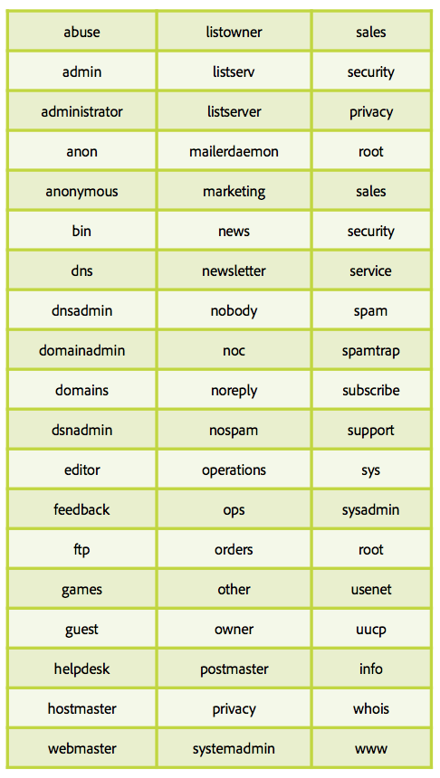
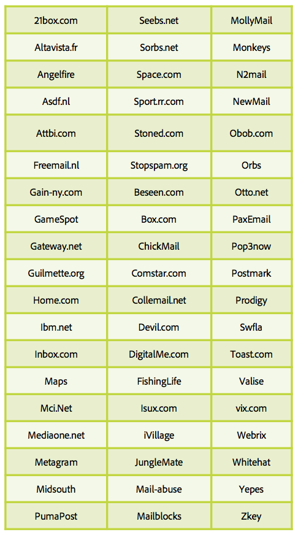

# En savoir plus sur les pièges à spam

Un [piège à spam](/help/metrics/spam-traps.md) est une adresse valide, qui n&#39;émet aucun message d&#39;erreur lorsque des emails lui sont envoyés. Un piège à spam a pour mission principale d&#39;identifier les spammeurs ou les expéditeurs n&#39;appliquant aucun processus d&#39;hygiène des données.

## Qui gère ces adresses de piège à spam ?

Le premier type d&#39;adresse de piège à spam est celui des entreprises de listes bloquées d&#39;adresses IP et de domaines, comme SpamHaus, Sorbs, SpamCop. Ces sociétés ont un immense réseau d&#39;adresses réparties sur diverses pages Internet comme des sites web, des blogs et des forums, ce qui permet à des spammeurs de les collecter.

Le deuxième type de piège à spam se base sur d’anciennes adresses de FAI actives. Ces FAI disposent de leur propre réseau de pièges à spam fondé sur des adresses inactives reconverties en pièges, chaque accès influant sur la réputation de l’adresse IP et du domaine d’expédition.

## Comment cela fonctionne-t-il ?

**Adresse email sans utilisateur final** : ces adresses n&#39;ont pas et n&#39;auront jamais d&#39;utilisateur final qui puisse s&#39;inscrire aux newsletters ou à tout autre type de communication.

**Adresse email abandonnée par un utilisateur** : suite à une période d&#39;inactivité, les adresses sont désactivées par les FAI. Les messages de rebond sont envoyés aux expéditeurs pour les informer de ce nouveau statut. Les expéditeurs doivent envoyer ces adresses en quarantaine ou les supprimer des futures communications. Les FAI utilisent ces adresses transformées en &quot;piège à spam&quot; pour surveiller les expéditeurs qui appliquent de mauvaises pratiques.

## Comment reconnaître ou identifier un piège à spam ?

Il est difficile d&#39;identifier les pièges à spam. Ces adresses doivent rester anonymes car elles sont utilisées pour identifier les expéditeurs malveillants. La plupart des FAI n&#39;ont pas de système de détection d&#39;ouvertures et de clics pour surveiller les accès des expéditeurs inappropriés. Selon les définitions précédentes, il est possible de déterminer un groupe d&#39;adresses suspectes et de tester l&#39;efficacité de la sélection de ce groupe.

## Pourquoi votre base de données est-elle infectée par des pièges à spam ?

Comment est-il possible que votre base de données d&#39;adresses email contienne un piège à spam ? Les deux principales raisons sont le manque de procédures d&#39;hygiène dans la base de données ou un dysfonctionnement de la collecte.

Ces quelques points peuvent vous aider à vérifier vos processus :

* Dysfonctionnement de la collecte :
   * D&#39;où viennent vos adresses électroniques ? Combien de sources sont utilisées pour collecter ces adresses ? Êtes-vous capable de les identifier ? Inscription interne / co-inscription ?
   * Votre système d&#39;opt-in fonctionne-t-il correctement ?
   * Avez-vous vérifié les domaines et l&#39;alias de vos adresses ? Faites-le avec le tableau ci-dessous !
* Processus d&#39;hygiène des bases de données :
   * Quel est votre processus concernant une adresse inactive au cours des 12 derniers mois ?
   * Traitez-vous une quarantaine sur les rebonds temporaires comme « utilisateur inactif » ?
   * Quand avez-vous pris soin de votre base de données pour la dernière fois et essayé de la nettoyer ? Faites-le régulièrement.

## Alias et domaines à éviter

**Alias**

**Domaines**

