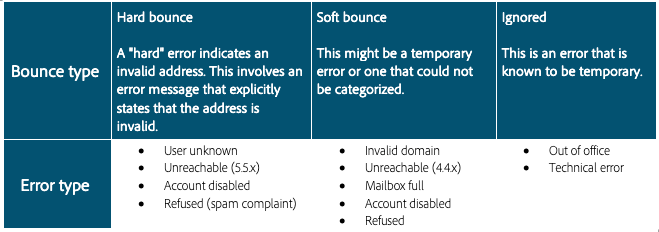

# Rebonds

Les rebonds sont le résultat d’une tentative de diffusion ayant échoué pour laquelle le FAI renvoie des avis d’échec. Le traitement de la gestion des rebonds est un aspect essentiel de l’hygiène des listes. Une fois qu’un e-mail donné a été rejeté plusieurs fois de suite, ce processus le signale pour qu’il soit supprimé. Le nombre et le type de rebonds requis pour déclencher la suppression varient d’un système à un autre. Ce processus empêche les systèmes de continuer à envoyer des adresses email non valides. Les rebonds sont l’un des éléments clés des données que les FAI utilisent pour déterminer la réputation des adresses IP. Il est très important de surveiller cette mesure. « Diffusé » par rapport à « Rejeté » est probablement le moyen le plus courant de mesurer la diffusion des messages marketing : plus le pourcentage de diffusion est élevé, mieux c’est.

Nous allons découvrir plus en détail deux types différents de rebonds.

## Rebonds définitifs

Les rebonds définitifs sont des échecs permanents générés après qu’un FAI ait déterminé qu’une tentative d’envoi à une adresse d’abonné n’était pas délivrable. Dans Adobe Campaign, les rebonds définitifs classée comme non délivrables sont ajoutés à la quarantaine, ce qui signifie qu’ils ne seront pas retentés. Dans certains cas, un rebond définitif peut être ignoré si la cause de l’échec est inconnue.
Voici quelques exemples courants de rebonds définitifs :

* Adresse inexistante
* Compte désactivé
* Syntaxe incorrecte
* Domaine incorrect

## Rebonds temporaires

Les rebonds temporaires sont des échecs temporaires que les FAI génèrent lorsqu’ils ont des difficultés à diffuser un e-mail. Les erreurs soft feront l’objet de plusieurs reprises (avec des écarts selon l’utilisation de paramètres de diffusion personnalisés ou d’usine) afin de réussir la diffusion. Les adresses qui continuent à provoquer des rebonds temporaires ne seront pas mises en quarantaine tant que le nombre maximum de tentatives n’aura pas été effectué (qui varie encore selon les paramètres). Voici quelques-unes des causes courantes de rebonds temporaires :

* Boîte pleine
* Serveur de réception d’emails en panne
* Problèmes liés à la réputation de l&#39;expéditeur

>[!NOTE]
>
>Les rebonds sont un indicateur clé d’un problème de réputation, car ils peuvent mettre en évidence une source de données incorrecte (rebond définitif) ou un problème de réputation avec un FAI (rebond temporaire).
>
>Les rebonds temporaires se produisent souvent dans le cadre de l’envoi d’un e-mail et doivent être autorisés à être résolus pendant les reprises avant de devenir un véritable problème de délivrabilité. Si votre taux de rebonds temporaires est supérieur à 30 % pour un seul FAI et qu’il n’est pas résolu dans un délai de 24 heures, il est préférable de contacter votre consultant Adobe Campaign en matière de délivrabilité.

## Ressources spécifiques au produit

**Adobe Campaign Classic**

* [Types de diffusion en échec et raisons](https://experienceleague.adobe.com/docs/campaign-classic/using/sending-messages/monitoring-deliveries/understanding-delivery-failures.html?lang=fr-FR#delivery-failure-types-and-reasons)
* [Gestion des e-mails rejetés](https://experienceleague.adobe.com/docs/campaign-classic/using/sending-messages/monitoring-deliveries/understanding-delivery-failures.html?lang=fr-FR#bounce-mail-management)
* [Rapport des non-délivrables et des e-mails rejetés](https://experienceleague.adobe.com/docs/campaign-classic/using/reporting/reports-on-deliveries/global-reports.html?lang=fr-FR#non-deliverables-and-bounces)

**Adobe Campaign Standard**

* [Types de diffusion en échec et raisons](https://experienceleague.adobe.com/docs/campaign-standard/using/testing-and-sending/monitoring-messages/understanding-delivery-failures.html?lang=fr-FR#delivery-failure-types-and-reasons)
* [Qualification des e-mails rejetés](https://experienceleague.adobe.com/docs/campaign-standard/using/testing-and-sending/monitoring-messages/understanding-delivery-failures.html?lang=fr-FR#bounce-mail-qualification)
* [Rapport récapitulatif des e-mails rejetés](https://experienceleague.adobe.com/docs/campaign-standard/using/reporting/list-of-reports/bounce-summary.html?lang=fr-FR#reporting)
