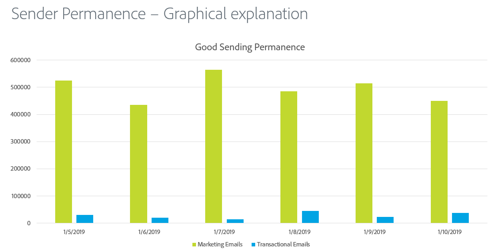

# Permanence de l&#39;expéditeur

L’envoi permanent est le processus d’établissement d’un volume d’envoi et d’une stratégie cohérents afin de maintenir la réputation du FAI. Voici quelques raisons pour lesquelles la permanence de l’expéditeur est importante :

* En règle générale, les spammeurs &quot;saut d’adresse IP&quot;, ce qui signifie qu’ils déplacent constamment le trafic entre plusieurs adresses IP pour éviter des problèmes de réputation.
* La cohérence est essentielle pour prouver aux FAI que l&#39;expéditeur est fiable et ne tente pas de contourner les problèmes de réputation dus à de mauvaises pratiques d&#39;envoi.
* Le maintien de ces stratégies cohérentes sur une longue période de temps est nécessaire avant que certains FAI ne considèrent même l&#39;expéditeur comme tout simplement fiable.

**Voici quelques exemples :**

