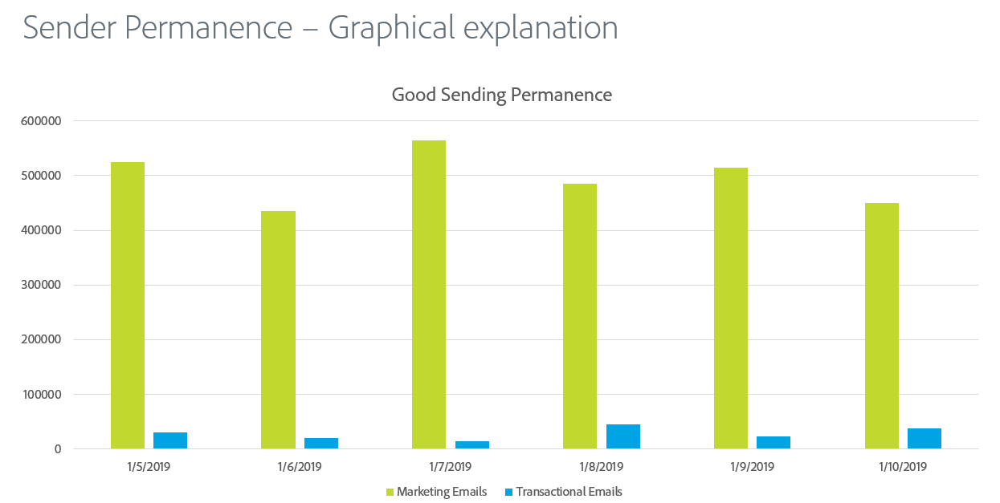
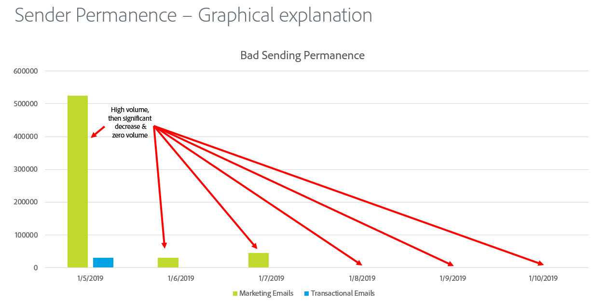

# Permanence de l&#39;expéditeur

La permanence de l&#39;envoi est le processus d&#39;établissement d&#39;un volume d&#39;envoi et d&#39;une stratégie cohérents afin de maintenir la réputation du FAI. Voici quelques raisons pour lesquelles la permanence de l&#39;expéditeur est importante :

* Les spammeurs optent généralement pour le terme « saut d&#39;adresse IP », ce qui signifie qu&#39;ils déplacent constamment le trafic sur de nombreuses adresses IP afin d&#39;éviter des problèmes de réputation.
* La cohérence est essentielle pour prouver aux FAI que l’expéditeur jouit d’une bonne réputation et qu’il ne tente pas de contourner les problèmes de réputation résultant de mauvaises pratiques d’envoi.
* Le maintien de ces stratégies cohérentes sur une longue période est nécessaire avant que certains FAI ne considèrent même l&#39;expéditeur comme digne de confiance.

**Voici quelques exemples :**

