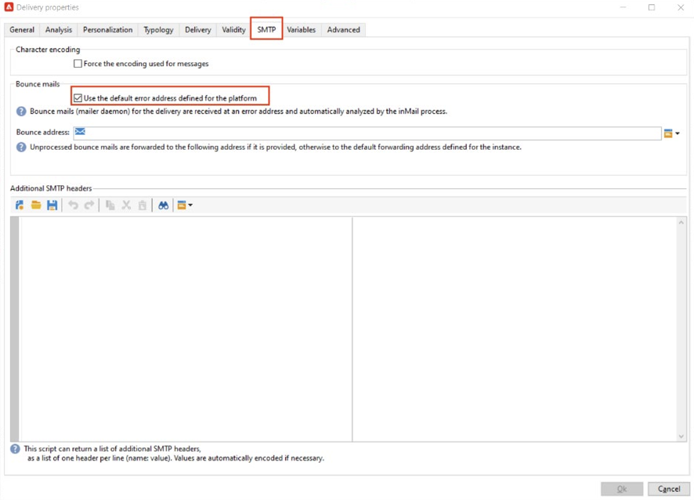

# Implémentation de [!DNL Domain-based Message Authentication, Reporting and Conformance] (DMARC)

L’objectif de ce document est de fournir au lecteur des informations supplémentaires sur la méthode d’authentification des e-mails, DMARC. En expliquant le fonctionnement de DMARC et ses différentes options de stratégie, les lecteurs pourront mieux comprendre l’impact de DMARC sur la délivrabilité des e-mails.

## Qu’est-ce que DMARC ? {#about}

Domain-based Message Authentication, Reporting and Conformance est une méthode d’authentification d’e-mail qui permet aux propriétaires de domaine de protéger leur domaine contre une utilisation non autorisée. DMARC fournit également des commentaires sur le statut d’authentification des e-mails et permet aux expéditeurs et expéditrices de contrôler ce qui arrive aux e-mails qui ne parviennent pas à s’authentifier. Cela inclut des options de surveillance, de mise en quarantaine ou de rejet du courrier, selon la politique DMARC mise en œuvre.

DMARC propose trois options de politique :

* **Surveiller (p=aucun) :** indique au fournisseur de boîtes aux lettres/FAI de faire ce qu’il ferait normalement avec le message.
* **Quarantaine (p=quarantaine) :** indique au fournisseur de boîtes aux lettres/FAI de diffuser l’e-mail qui ne transmet pas DMARC au dossier des courriers indésirables ou du courrier indésirable du destinataire.
* **Rejet (p=rejet) :** indique au fournisseur de boîte aux lettres/FAI de bloquer les e-mails qui ne transmettent pas DMARC et qui provoquent un rebond.

## Comment DMARC fonctionne-t-il ? {#how}

SPF et DKIM sont tous deux utilisés pour associer un e-mail à un domaine et permettent d’authentifier les e-mails. DMARC va encore plus loin et permet d’éviter les usurpations en faisant correspondre le domaine vérifié par DKIM et SPF. Pour passer DMARC, un message doit passer SPF ou DKIM. Si l’authentification des deux échoue, DMARC échoue et l’e-mail est envoyé conformément à la politique DMARC que vous avez sélectionnée.

>[!NOTE]
>
>DMARC requiert l’alignement entre les adresses « De » et « Chemin de retour ».

## Pourquoi DMARC doit-il être implémenté ? {#why}

DMARC est facultatif. Bien qu’il ne soit pas obligatoire, il est gratuit et permet aux destinataires d’e-mails d’identifier facilement l’authentification des e-mails, ce qui pourrait améliorer la diffusion. L’un des principaux avantages de DMARC est qu’il permet de créer des rapports sur les messages qui échouent SPF et/ou DKIM. Il permet également aux expéditeurs de contrôler dans une certaine mesure ce qui se passe avec les e-mails qui ne transmettent aucune de ces méthodes d’authentification. Grâce à la création de rapports DMARC, les expéditeurs et les expéditrices bénéficient d’une visibilité sur les messages en échec de DMARC, ce qui permet de prendre des mesures pour atténuer les erreurs supplémentaires.

>[!NOTE]
>
>Si vous souhaitez implémenter BIMI, une politique p=quarantaine ou p=rejet DMARC est requise.

## Bonnes pratiques relatives à l’implémentation de DMARC {#best-practice}

DMARC étant facultatif, il ne sera pas configuré par défaut sur la plateforme d’aucun fournisseur de service de messagerie. Pour que votre domaine fonctionne, un enregistrement DMARC doit être créé dans le DNS. De plus, une adresse e-mail de votre choix est requise pour indiquer où les rapports DMARC doivent se trouver au sein de votre organisation. Il s’agit d’une bonne pratique :
Il est recommandé de déployer lentement l’implémentation de DMARC en faisant passer votre politique DMARC de p=none, à p=quarantine, à p=reject lorsque vous comprenez mieux l’impact potentiel de DMARC.

1. Analysez les commentaires que vous recevez et utilisez (p=none), qui indique au destinataire de n’effectuer aucune action sur les messages dont l’authentification a échoué, mais d’envoyer tout de même des rapports par e-mail à l’expéditeur. En outre, examinez les problèmes liés à SPF/DKIM et corrigez-les si des messages légitimes échouent à l’authentification.
1. Déterminez si SPF et DKIM sont alignés et transmettent l’authentification pour tous les e-mails légitimes, puis déplacez la politique sur (p=quarantaine), qui indique au serveur de messagerie de réception de mettre en quarantaine les e-mails dont l’authentification échoue (cela signifie généralement placer ces messages dans le dossier des courriers indésirables).
1. Ajuster la politique sur (p=rejet). La politique p=reject indique à la personne destinataire de refuser complètement (rebond) tout e-mail pour le domaine qui ne réussit pas l’authentification. Lorsque cette politique est activée, seul un e-mail qui est vérifié comme étant authentifié à 100 % par votre domaine aura une chance d’être placé en boîte de réception.

   >[!NOTE]
   >
   >Utilisez cette politique avec précaution et déterminez si elle est appropriée pour votre organisation.

## Création de rapports DMARC {#reporting}

DMARC permet de recevoir des rapports concernant les e-mails qui échouent SPF/DKIM. Les serveurs de FAI génèrent deux rapports différents dans le cadre du processus d’authentification que les expéditeurs peuvent recevoir via les balises RUA/RUF dans leur politique DMARC :

* **Rapports agrégés (RUA) :** ne contient aucune PII (informations d’identification personnelle) qui serait sensible au RGPD.
* **Rapports de police scientifique (RUF) :** contient des adresses e-mail qui sont sensibles au RGPD. Avant d’utiliser , il est préférable de vérifier en interne comment traiter les informations qui doivent être conformes au RGPD.

Ces rapports sont principalement utilisés pour recevoir un aperçu des e-mails qui sont tentés de mystifier. Il s’agit de rapports hautement techniques qui sont mieux assimilés par un outil tiers. Voici quelques sociétés spécialisées dans la surveillance DMARC :

* [ValiMail](https://www.valimail.com/products/#automated-delivery)
* [Agari](https://www.agari.com/)
* [Dmarcien](https://dmarcian.com/)
* [Proofpoint](https://www.proofpoint.com/us)

>[!CAUTION]
>
>Si les adresses e-mail que vous ajoutez pour recevoir des rapports se trouvent en dehors du domaine pour lequel l’enregistrement DMARC est créé, vous devez autoriser leur domaine externe à indiquer au DNS que vous possédez ce domaine. Pour ce faire, procédez comme décrit dans la section [Documentation dmarc.org](https://dmarc.org/2015/08/receiving-dmarc-reports-outside-your-domain).

### Exemple d’enregistrement DMARC {#example}

```
v=DMARC1; p=reject; fo=1; rua=mailto:dmarc_rua@emaildefense.proofpoint.com;ruf=mailto:dmarc_ruf@emaildefense.proofpoint.co
```

## Balises DMARC et leurs fonctions {#tags}

Les enregistrements DMARC comportent plusieurs composants appelés balises DMARC. Chaque balise possède une valeur qui spécifie un certain aspect de DMARC.

| Nom de la balise | Obligatoire / Facultatif | Fonction | Exemple | Valeur par défaut |
|  ---  |  ---  |  ---  |  ---  |  ---  |
| v | Obligatoire | Cette balise DMARC spécifie la version. Il n’existe qu’une seule version à ce jour. Sa valeur est donc fixe v=DMARC1 | V=DMARC1 DMARC1 | DMARC1 |
| p | Obligatoire | Affiche la politique DMARC sélectionnée et demande au destinataire de signaler, mettre en quarantaine ou rejeter les e-mails dont les contrôles d&#39;authentification ont échoué. | p=aucun, mise en quarantaine ou rejet | - |
| pour | Facultatif | Permet au propriétaire du domaine de spécifier des options de création de rapports. | 0 : générer un rapport en cas d’échec<br/>1 : générer un rapport en cas d’échec<br/>d : générer un rapport en cas d’échec de DKIM : générer un rapport en cas d<br/>échec de SPF | 1 (recommandé pour les rapports DMARC) |
| pct | Facultatif | Indique le pourcentage de messages soumis à un filtrage. | pct=20 | 100 |
| rua | Facultatif (recommandé) | Indique où les rapports agrégés seront diffusés. | `rua=mailto:aggrep@example.com` | - |
| ruf | Facultatif (recommandé) | Identifie l’endroit où les rapports d’analyse seront remis. | `ruf=mailto:authfail@example.com` | - |
| sp | Facultatif | Indique la politique DMARC pour les sous-domaines du domaine parent. | sp=rejet | - |
| adkim | Facultatif | Peut être Strict (s) ou Relaxed (r). L’alignement relâché signifie que le domaine utilisé dans la signature DKIM peut être un sous-domaine de l’adresse « De ». Un alignement strict signifie que le domaine utilisé dans la signature DKIM doit correspondre exactement au domaine utilisé dans l’adresse de l’expéditeur. | adkim=r | r |
| aspf | Facultatif | Peut être Strict (s) ou Relaxed (r). L’alignement relâché signifie que le domaine ReturnPath peut être un sous-domaine de l’adresse d’expédition. Un alignement strict signifie que le domaine Return-Path doit correspondre exactement à l&#39;adresse d&#39;expédition. | aspf=r | r |

## DMARC et Adobe Campaign {#campaign}

>[!NOTE]
>
>Si votre instance Campaign est hébergée sur AWS, vous pouvez implémenter DMARC pour vos sous-domaines avec le Panneau de Contrôle . [Découvrez comment implémenter des enregistrements DMARC à l’aide de Panneau de Contrôle](https://experienceleague.adobe.com/docs/control-panel/using/subdomains-and-certificates/txt-records/dmarc.html).

Une raison courante des échecs de DMARC est le mauvais alignement entre l’adresse « De » et l’adresse « Erreurs vers » ou « Chemin de retour ». Pour éviter cela, lors de la configuration de DMARC, il est recommandé de vérifier à nouveau les paramètres d’adresse « De » et « Erreurs vers » dans vos modèles de diffusion.

1. Dans votre modèle de diffusion, passez en revue l’adresse actuellement définie comme adresse d’expédition.

   

1. À partir de là, sélectionnez « Propriétés » qui vous permettra de modifier davantage votre modèle de diffusion. Dans cette fenêtre, sélectionnez SMTP et décochez la case « Utiliser l’adresse d’erreur par défaut définie pour la plateforme » si elle est sélectionnée. Dans Adobe Campaign, les modèles de diffusion cochent cette case par défaut. L’adresse d’erreur par défaut peut ne pas être l’adresse associée à l’adresse de l’expéditeur dans ce modèle de diffusion.

   

1. Lorsque cette case est décochée, un champ de texte s’affiche et vous permet de saisir une adresse d’erreur unique qui utilise le même domaine que celui défini dans l’adresse d’expédition.

   

Une fois ces modifications enregistrées, vous pourrez poursuivre l’implémentation de DMARC avec un alignement de domaine correct.

## Liens utiles {#links}

* [DMARC.org](https://dmarc.org/){target="_blank"}
* [Authentification par e-mail M3AAWG](https://www.m3aawg.org/sites/default/files/document/M3AAWG_Email_Authentication_Update-2015.pdf){target="_blank"}
