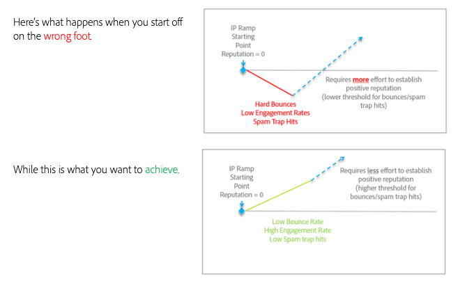

# Transition en douceur lors du changement de plateforme de messagerie

Lors du déplacement des fournisseurs de services de messagerie électronique (ESP), il n’est pas possible de faire également la transition entre vos adresses IP existantes et établies. Il est important que vous suiviez les bonnes pratiques pour développer une réputation positive lors d’un nouveau départ. Comme les nouvelles adresses IP que vous allez utiliser n’ont pas encore de réputation, les FAI ne peuvent pas entièrement faire confiance au courrier qui leur vient et doivent être prudents dans ce qu’ils permettent d’envoyer à leurs clients.

Établir une réputation positive est un processus. Mais une fois établi, de petits indicateurs négatifs auront moins d&#39;impact sur vous et votre diffusion par courrier.

Le temps nécessaire au contrôle de vos adresses et domaines IP peut varier, mais jusqu’à huit semaines de référence est courant pour les expéditeurs types d’établir une réputation dans la plupart des FAI de niveau 1 (Gmail, Microsoft, Verizon/Yahoo/AOL, etc.).

Dans les sections suivantes, nous allons étudier certains domaines clés sur lesquels se concentrer pour embarquer correctement :

1. [Infrastructure](/help/transition-process/infrastructure.md)
2. [Critères de ciblage](/help/transition-process/targeting-criteria.md)
3. [Considérations spécifiques aux fournisseurs d&#39;accès lors du réchauffement des adresses IP](/help/transition-process/isp-specific-considerations-during-ip-warming.md)
4. [Volume](/help/transition-process/volume.md)
